# 🏎️ TrackForge

**TrackForge** is a full-featured Laravel e-commerce platform built for a toy car store — combining a polished customer-facing shop with a private admin panel for complete store management.


---

## ✨ Features

### 🛒 Shop (Customer Side)
- Browse products across categories — RC Cars, Die-Cast, Metal Cars, Baby Cars, Race Tracks, Monster Trucks, Robot Cars, Electric Cars
- Product detail pages with multiple images, specifications, ratings, and badges (New / Hot / Sale)
- Shopping cart with live totals
- Smart checkout flow:
  - 🎟️ Coupon code system — percentage or fixed discounts, minimum order thresholds, per-user usage limits
  - 💳 Cash on Delivery (COD) and prepaid card payment options
  - 🚚 Automatic delivery charge calculation with free-delivery threshold
- Order confirmation page with order summary

### 🔐 Admin Panel
- Secure, dedicated admin login
- Product management — create, edit, delete, multi-image upload
- Category management
- Order management and tracking
- Coupon management
- Store settings — store name, WhatsApp contact number, delivery charges, free delivery threshold

---

## 🛠️ Tech Stack

| Layer      | Technology         |
|------------|---------------------|
| Backend    | Laravel (PHP 8.2+)  |
| Frontend   | Blade Templates, CSS |
| Database   | MySQL               |
| Build Tool | Vite                |

---

## 📂 Project Structure

```
trackforge/
├── app/
│   ├── Http/Controllers/       # Shop, Cart, Checkout, Admin controllers
│   └── Models/                 # Product, Category, Order, Coupon, Setting, User
├── database/
│   ├── migrations/
│   └── seeders/DatabaseSeeder.php
├── resources/
│   └── views/
│       ├── shop/               # Product listing & detail pages
│       ├── cart/                # Cart page
│       ├── checkout/            # Checkout & order success
│       ├── admin/               # Admin login & dashboard
│       └── layouts/             # Shared layouts
└── routes/
    └── web.php
```

---

## 🚀 Getting Started

### Prerequisites
- PHP >= 8.2
- Composer
- MySQL
- Node.js & npm

### Installation

```bash
# 1. Clone the repository
git clone https://github.com/your-username/trackforge.git
cd trackforge

# 2. Install PHP dependencies
composer install

# 3. Install JS dependencies & build assets
npm install
npm run build

# 4. Set up environment
cp .env.example .env
php artisan key:generate

# 5. Configure your database in .env, then migrate & seed
php artisan migrate --seed

# 6. Start the dev server
php artisan serve
```

### Environment Configuration

```env
APP_NAME="TrackForge"
APP_URL=http://127.0.0.1:8000

DB_DATABASE=trackforge
DB_USERNAME=your_username
DB_PASSWORD=your_password
```

### Admin Access

An admin account is created automatically when you seed the database. Check `database/seeders/DatabaseSeeder.php` for the default credentials — **change the password immediately after first login.**

Admin panel: `http://127.0.0.1:8000/admin/login`

---

## 📸 Screenshots

### 🏠 Home Page

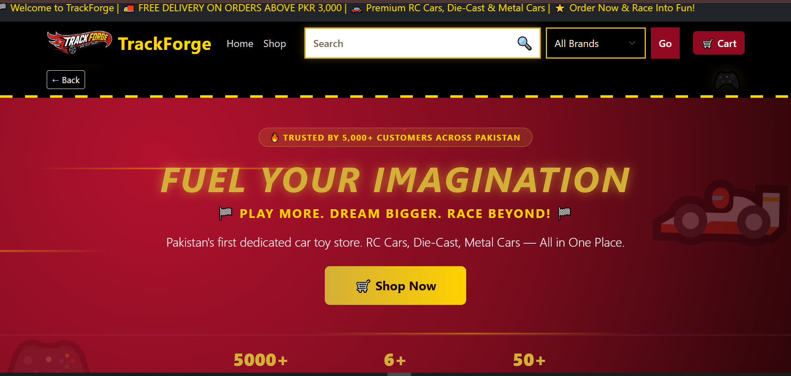
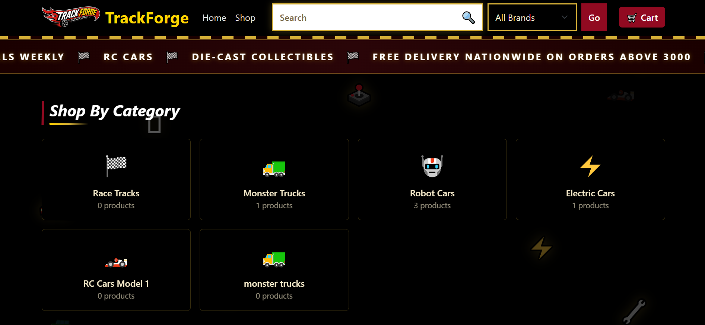
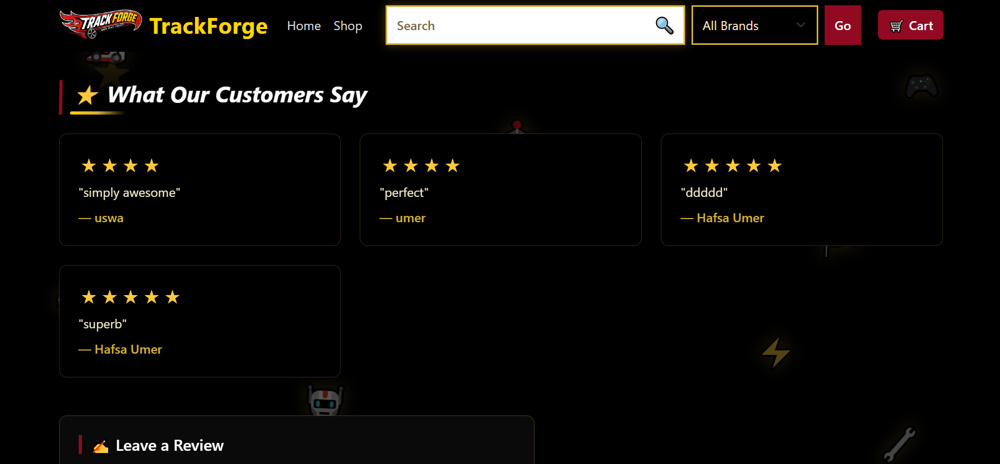
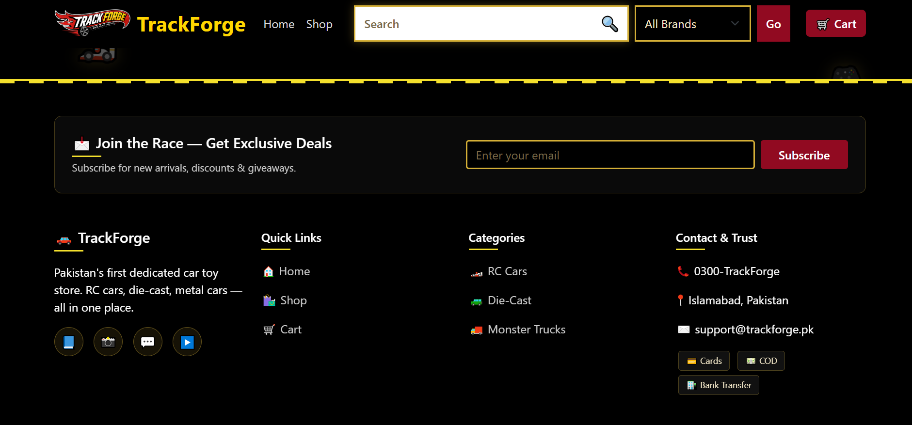
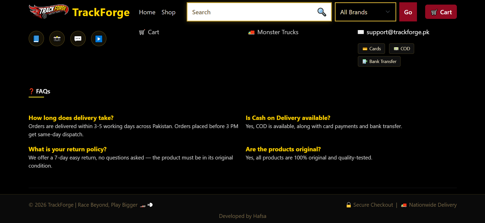

---
### 🛒 Shopping Cart

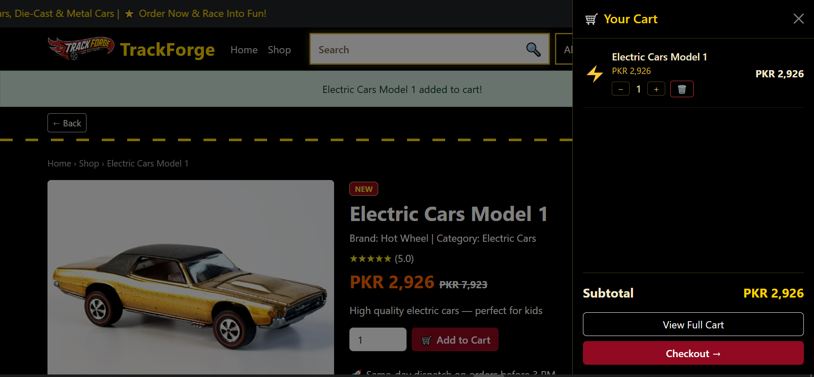
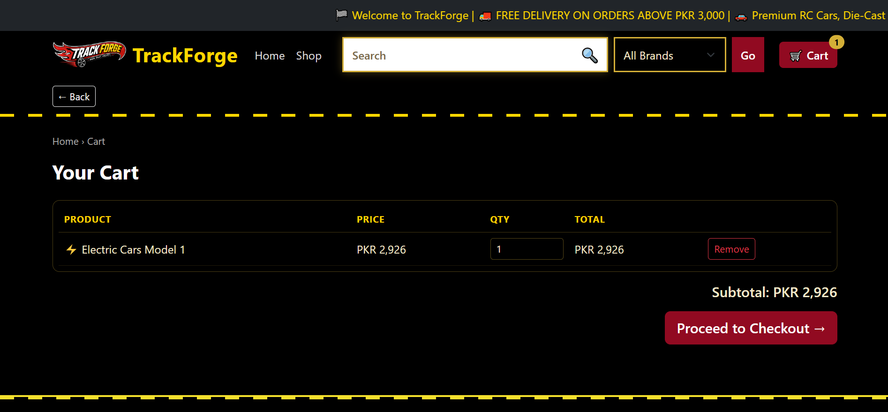

---
### 💳 Checkout

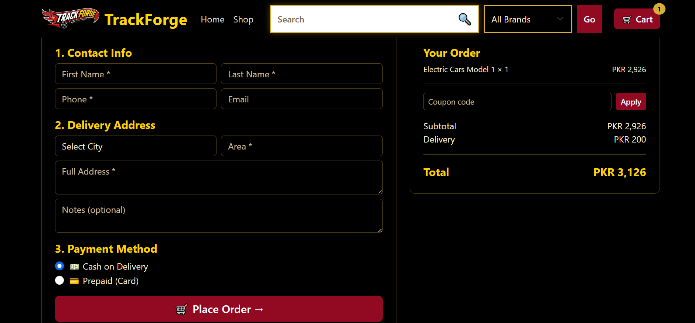

---
### 🚗 Product Details

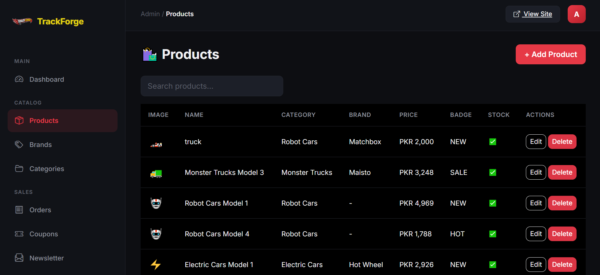

---


### 🔐 Admin Dashboard

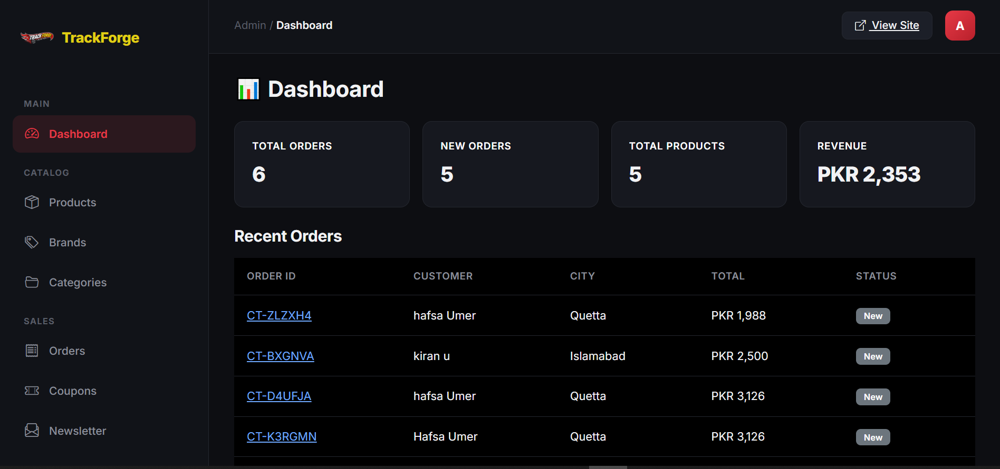

---
### 🏷️ Brands
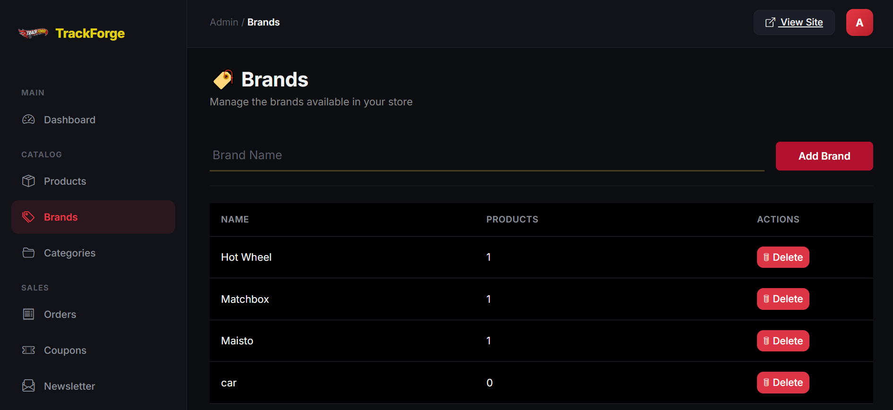
---

### 📂 Categories

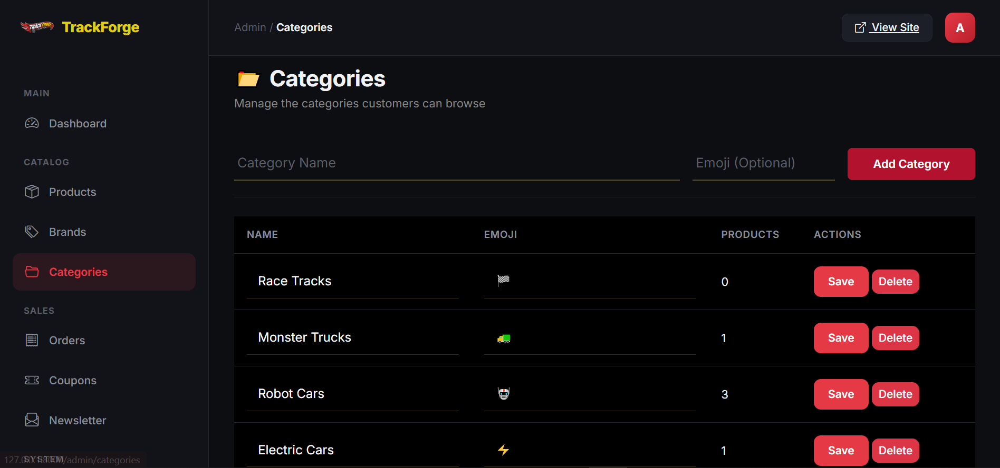

---

### 🎟️ Coupons

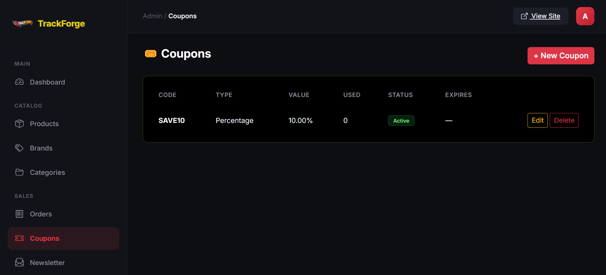


## 🗺️ Roadmap

- [ ] Order status notifications (email/WhatsApp)
- [ ] Product reviews & ratings by customers
- [ ] Wishlist feature
- [ ] Payment gateway integration

---

## 🤝 Contributing

Contributions, issues, and feature requests are welcome. Feel free to open a pull request or an issue.

## 📄 License

This project is open-sourced software.
